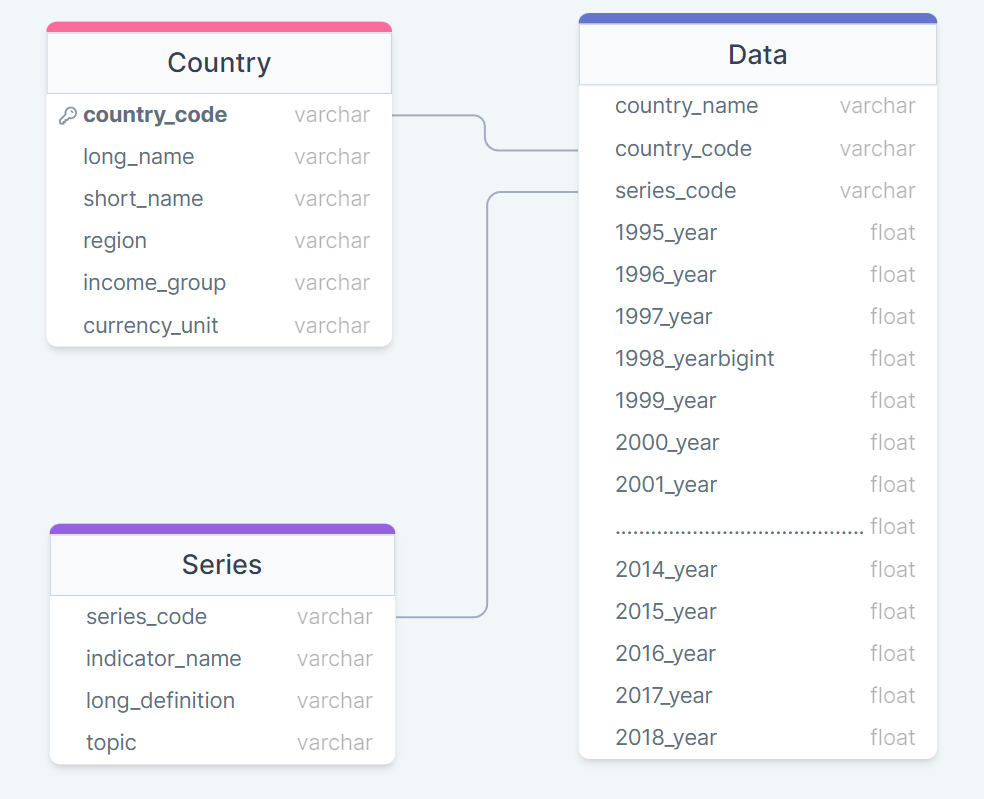
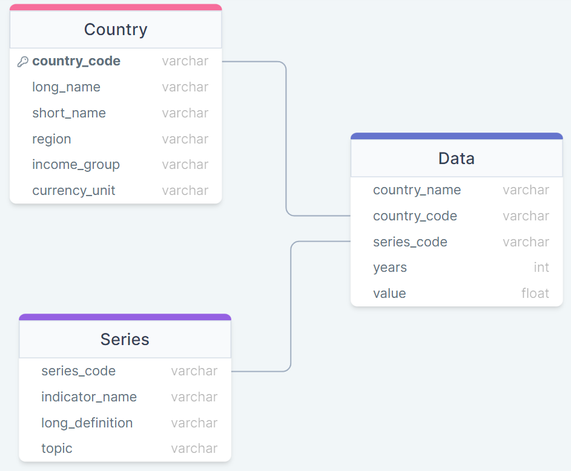
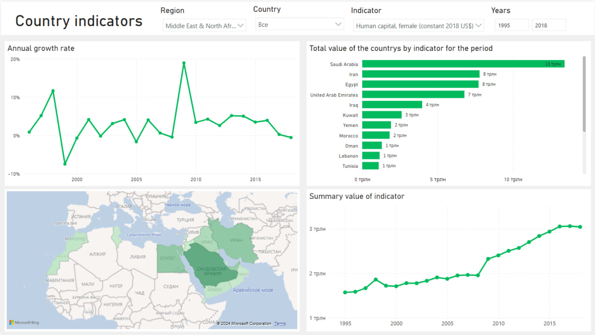
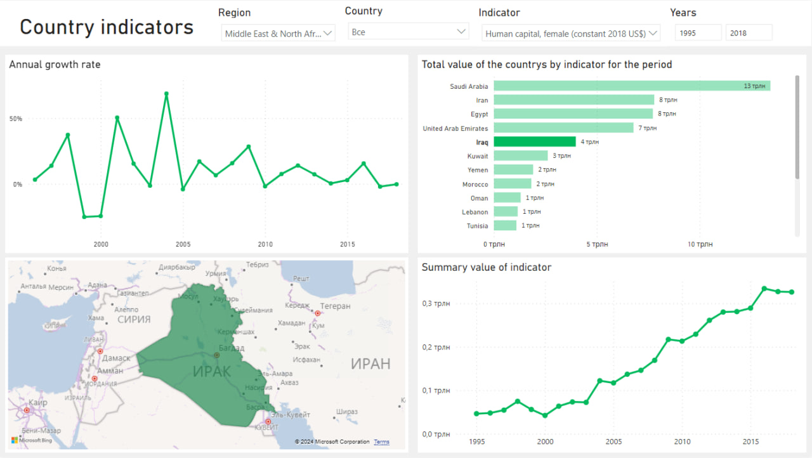
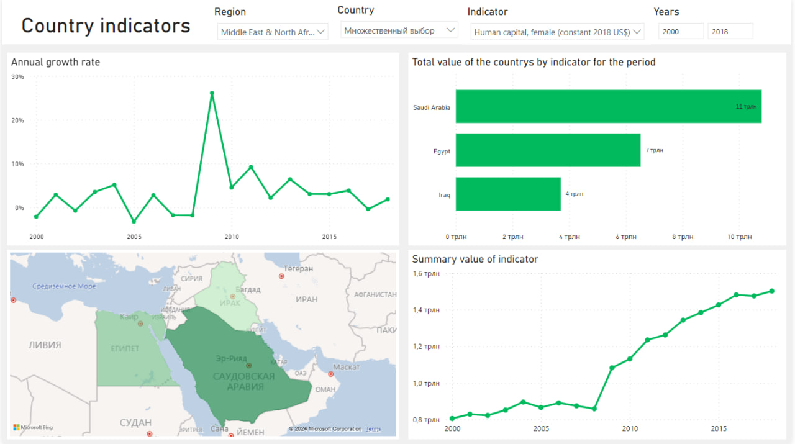

# Country indicators

🎯***Цель данного проекта*** заключается в создании базы данных в PostgreSQL, формировании таблиц и загрузке данных из CSV-файлов, с последующей визуализацией данных в дашборд

## Ход выполнения проекта

📖 **Чтение CSV-файлов и преобразование в датафреймы:** В первой части проекта производится чтение CSV-файлов и их преобразование в датафреймы при помощи библиотеки pandas

🧹**Очистка и обработка данных:** Проводится предварительная очистка и обработка данных, приведение их к необходимому формату
 
🔐 **Создание базы данных в PostgreSQL:** Создается база данных в PostgreSQL, где будут храниться данные

🗂  **Создание таблиц в базе данных:** Определяются структуры таблиц в базе данных, соответствующие хранению данных из датафреймов

🔢 **Заполнение таблиц данными из датафреймов:** Данные из датафреймов загружаются в созданные таблицы в PostgreSQL

🖼 **Визуализация данных из PostgreSQL:** Использование Power BI для создания дашборда, отображаего интересующие параметры и метрики на основе данных из PostgreSQL

## Первая часть проекта

В файле [DB creation](https://github.com/GulkoMI/country-indicators/blob/main/DB%20creation.ipynb) представлен код, демонстрирующий процесс создания базы данных в среде Python. Этот этап включает в себя создание структуры базы данных, заполнение ее данными и подготовку к финальному этапу визуализации. Код служит ключевым шагом в развитии проекта, подготавливая основу для анализа и предоставляя необходимые данные для дальнейших этапов работы

### Схема базы данных 

В результате первого этапа мы получили схему данных, представленную следующим образом:



## Вторая часть проекта

Вторая часть проекта полностью посвящена визуализации, результат которой представлен в файле [Dashboard](Dashboard.pbix).

### Импорт данных из PostgreSQL

Для начала мы проводим импорт данных из нашей базы данных PostgreSQL в Power BI

### Преобразование структуры таблицы 'data' в Power Query Editor

1. Выделяем столбцы с 1995 по 2018 годы, удерживая клавишу CTRL
   
3. После выделения, применяем функцию 'Отмена свертывания столбцов'
   
5. Полученный результат включает новые столбцы: 'Attribute' (с названиями выделенных столбцов) и 'Value' (с их значениями)
   
7. Переименовываем первый столбец в 'Year' и очищаем его, удаляя приставку 'year_' у значений
   
9. Выбираем тип данных 'целое число' для столбца 'Year' для обеспечения удобства использования при срезе в будущем

### Обновленная схема базы данных

В результате преобразований, схема данных теперь представлена следующим образом:



### Создание меры 

В разделе 'Представление таблицы' выберем таблицу 'data' и во вкладке 'Средства работы с таблицами' создадим меру с использованием следующей формулы:

```dax
Growth Rate = 
VAR CurrentYear = MAX('public data'[year])
VAR PrevYear = CurrentYear - 1
VAR CurrentYearValue = CALCULATE(SUM('public data'[value]), 'public data'[year] = CurrentYear)
VAR PrevYearValue = CALCULATE(SUM('public data'[value]), 'public data'[year] = PrevYear)
RETURN IF(ISBLANK(CurrentYearValue) || ISBLANK(PrevYearValue), BLANK(), (CurrentYearValue - PrevYearValue) / PrevYearValue)
```
Данная мера будет отображать годовой прирост значений по выбранному показателю

### Визуальные элементы

1. **Срезы по регионам, странам, названиям показателей и годам:** Используя срезы, пользователь cможет выбрать конкретно интересующие данные по различным параметрам

2. **Карта:** На карте выделены выбранные страны, и интенсивность цвета зависит от значения выбранного показателя. Чем выше значение, тем темнее цвет страны

3. **Линейный график изменения значений показателя:** График отображает динамику изменения (сумму) значений показателя для страны (стран) в течение лет

4. **Линейная диаграмма:** Представляет сумму значений показателя для конкретных стран за определенный период времени

5. **Линейный график с использованием меры годового прироста:** Показывает годовой прирост значений по выбранному показателю

## Итоговый вид дашборда

### Анализ конкретно региона


### Выбор интересующей страны в регионе с использованием ее выделения на диаграмме


### Анализ интересующих стран в заданном временном промежутке при помощи срезов



